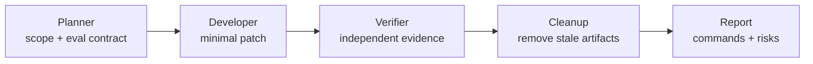
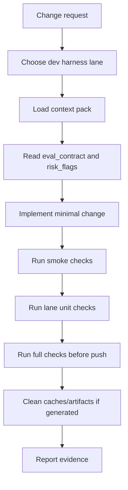

# Development Harness

이 문서는 GAIA/OpenClaw 프로젝트를 개발할 때 사용하는 개발용 하네스다. 기존 runtime harness가 웹사이트를 테스트하기 위한 실행 장치라면, development harness는 우리가 이 프로젝트 자체를 안전하게 변경하기 위한 장치다.

사용자가 제시한 [revfactory/harness](https://github.com/revfactory/harness)를 기준 구조로 삼되, 이 저장소는 Claude Code의 `.claude/agents`/`.claude/skills` 런타임이 아니라 Codex와 `AGENTS.md`, context pack, Python check script로 움직이므로 아래처럼 변환했다.

- revfactory의 agent definition은 이 프로젝트에서 `AGENT_HARNESS_PLAYBOOK.md`, lane manifest, Codex subagent role로 매핑한다.
- revfactory의 skill은 이 프로젝트에서 context pack, local script, 기존 Codex skill로 매핑한다.
- revfactory의 orchestrator는 `scripts/dev_harness.py plan/run/audit`와 Planner-Developer-Verifier-Cleanup 흐름으로 매핑한다.
- revfactory의 evolution mechanism은 `DEVELOPMENT_HARNESS_CHANGELOG.md`와 manifest 업데이트로 매핑한다.

핵심 목표는 간단하다.

- 변경 전에 필요한 context를 작게 고른다.
- 구현 전에 성공 조건과 eval contract를 고정한다.
- 변경 영역별로 최소 검증 명령을 표준화한다.
- pre-push 전에 넓은 회귀 검증을 수행한다.
- AI가 만든 임시 경로, fallback, stale artifact를 주기적으로 정리한다.

## Reference Model

인터넷 자료 기준으로 다음 구조를 이 프로젝트에 맞춰 적용했다.

- [revfactory/harness](https://github.com/revfactory/harness): Phase 0 audit, domain analysis, team architecture, agent definition, skill generation, orchestration, validation, evolution 흐름을 기준으로 삼았다.
- [ISTQB Test Harness Glossary](https://glossary.istqb.org/en_US/term/test-harness): 하네스를 개발 대상 주변의 driver, fixture, test data, oracle 계층으로 본다.
- [pytest fixtures](https://pytest.org/en/6.2.x/fixture.html?highlight=conftest): fixture는 명시적이고, 모듈화되고, scope를 가져야 한다. 이 프로젝트에서는 context pack, lane manifest, test fixture가 같은 역할을 한다.
- [Google Testing Blog small/medium/large tests](https://testing.googleblog.com/2011/03/how-google-tests-software-part-five.html): 테스트를 형식보다 scope로 나눈다. 이 프로젝트에서는 smoke, unit, full tier로 나눈다.
- [OpenAI Evals Guide](https://platform.openai.com/docs/guides/evals?api-mode=chat): 기대 행동을 먼저 정의하고 eval로 반복 측정한다. 이 프로젝트에서는 lane별 `eval_contract`를 먼저 본다.
- [GitHub Actions CI](https://docs.github.com/en/actions/get-started/continuous-integration): 로컬 검증과 PR 검증이 같은 명령을 쓰도록 유지한다.
- [Playwright Test Isolation](https://playwright.dev/python/docs/browser-contexts): browser/profile 상태는 격리해야 재현 가능하다. 이 원칙은 OpenClaw profile, multi-user participant profile에도 적용한다.

## Applied Shape

Development harness는 다섯 가지 파일로 구성된다.

- `docs/harness/development_harness_manifest.json`: 개발 lane, owned paths, risk flags, eval contract, checks의 source of truth.
- `scripts/dev_harness.py`: lane 목록, lane plan, lane별 check 실행 CLI.
- `docs/harness/DEVELOPMENT_HARNESS.md`: 팀원 설명용 문서.
- `docs/harness/DEVELOPMENT_HARNESS_CHANGELOG.md`: 하네스 진화 기록.
- `scripts/lint_harness_docs.py`: context manifest와 development harness manifest를 함께 검증한다.

## RevFactory Phase Mapping

| RevFactory phase | 이 프로젝트 적용 |
|------------------|------------------|
| Phase 0: 현황 감사 | `python scripts/dev_harness.py audit`로 lane/context/team pattern 현황 확인 |
| Phase 1: 도메인 분석 | 사용자 요청을 `goal-driven`, `multi-user-interaction`, `openclaw-dispatch` 같은 lane으로 분류 |
| Phase 2: 팀 아키텍처 설계 | lane별 `team_pattern`과 `recommended_agents`를 manifest에 기록 |
| Phase 3: 에이전트 정의 | 별도 `.claude/agents` 대신 `AGENT_HARNESS_PLAYBOOK.md`의 Planner/Developer/Verifier/Cleanup 역할 사용 |
| Phase 4: 스킬 생성 | 별도 `.claude/skills` 대신 context pack, local script, 기존 Codex skill 사용 |
| Phase 5: 통합/오케스트레이션 | `dev_harness.py plan/run`으로 누가 무엇을 어떤 순서로 검증할지 결정 |
| Phase 6: 검증/테스트 | `lint_harness_docs`, lane unit, full unit, `git diff --check` 실행 |
| Phase 7: 진화 | `DEVELOPMENT_HARNESS_CHANGELOG.md`에 변경 기록 후 manifest 갱신 |

## Team Architecture

기본 패턴은 `pipeline + producer-reviewer`다.



복잡한 작업에서는 revfactory/harness의 패턴을 Codex 방식으로 골라 쓴다.

- `pipeline`: 순차 의존이 큰 변경. 예: goal semantics 변경.
- `fan-out/fan-in`: 독립 조사가 가능한 변경. 예: 여러 benchmark failure 원인 비교.
- `expert-pool`: 특정 하위 시스템 전문가만 필요한 변경. 예: OpenClaw dispatch만 수정.
- `producer-reviewer`: 구현자와 검증자의 관점을 분리해야 하는 변경.
- `supervisor`: main Codex agent가 lane, risk, check 실행을 통합 관리.
- `hierarchical-delegation`: 큰 cross-lane 변경에서만 제한적으로 사용.

현재 Codex 환경에서는 사용자 요청 없이 임의로 subagent를 만들지 않는다. 대신 manifest는 "이 lane에서 어떤 역할이 필요한가"를 명시하고, 사용자가 서브에이전트 검증을 요청했을 때 바로 팀 구성을 잡을 수 있게 한다.

## Development Lane

lane은 변경의 성격이다. 예를 들어 `goal-driven`, `multi-user-interaction`, `openclaw-dispatch`는 서로 실패 양상이 다르기 때문에 같은 체크만 돌리면 안 된다.

각 lane은 아래 필드를 가진다.

- `summary`: 이 lane이 다루는 문제 영역.
- `context_area`: 먼저 읽어야 하는 context pack.
- `owned_paths`: 이 lane이 주로 책임지는 파일/디렉토리.
- `eval_contract`: 구현 전 확인해야 하는 기대 행동.
- `risk_flags`: 리뷰 때 먼저 의심해야 하는 실패 모드.
- `checks.smoke`: 개발 중 빠르게 돌릴 체크.
- `checks.unit`: lane 전용 회귀 테스트.
- `checks.full`: pre-push 전 넓은 체크.

## Workflow



## CLI Usage

Lane 목록을 본다.

```bash
python scripts/dev_harness.py list
```

현황 감사를 한다.

```bash
python scripts/dev_harness.py audit
```

변경 파일 기준으로 lane을 감지한다.

```bash
python scripts/dev_harness.py detect --changed
```

특정 lane의 개발 계획과 체크를 본다.

```bash
python scripts/dev_harness.py plan --lane multi-user-interaction
```

개발 중 빠른 smoke check를 실행한다.

```bash
python scripts/dev_harness.py run --lane multi-user-interaction --tier smoke
```

pre-push 전에 lane unit check를 실행한다.

```bash
python scripts/dev_harness.py run --lane multi-user-interaction --tier unit
```

실행하지 않고 명령만 확인한다.

```bash
python scripts/dev_harness.py run --lane goal-driven --tier full --dry-run
```

## Tiers

### Smoke

개발 중 자주 실행한다. 목표는 빠른 피드백이다.

예:

- context pack 렌더링
- docs lint
- touched core file `py_compile`

### Unit

lane-specific regression이다. 목표는 변경한 영역의 핵심 계약을 깨지 않았는지 확인하는 것이다.

예:

- `test_goal_achievement_runtime.py`
- `test_multi_user_interaction_runtime.py`
- `test_mcp_openclaw_dispatch_runtime.py`

### Full

pre-push 또는 큰 변경 후 실행한다. 목표는 다른 lane으로 번진 회귀를 잡는 것이다.

예:

- `PYTHONPATH=. .venv/bin/python -m pytest gaia/tests/unit -q`
- `git diff --check`

## How This Fits The Existing Harness

이 프로젝트에는 이미 runtime harness가 있다.

- goal-driven agent loop
- OpenClaw browser dispatch
- benchmark runner
- multi-user participant runtime
- blackboard/event-driven scheduler

Development harness는 그 위에 올라가는 meta-harness다. 즉, runtime harness를 계속 바꾸더라도 변경 전후의 안전장치를 고정한다.

## Team Contract

팀원이 이 프로젝트를 수정할 때 기본 규칙은 다음이다.

- 먼저 lane을 고른다.
- `scripts/context_pack.py --area <context_area>`로 작은 문맥만 읽는다.
- `scripts/dev_harness.py plan --lane <lane>`으로 eval contract와 risk flags를 확인한다.
- 구현은 최소 범위로 한다.
- 적어도 smoke와 lane unit을 통과시킨다.
- push 전에는 full check 또는 그에 준하는 근거를 남긴다.
- 실패하거나 생략한 체크는 최종 메시지에 명시한다.

## Lane Selection Guide

- `repo-entry`: 문서, manifest, context pack, harness script 변경.
- `goal-driven`: agent loop, decision parsing, WAIT completion, goal achievement 변경.
- `multi-user-interaction`: participant plan, blackboard, event-driven scheduler, profile isolation 변경.
- `openclaw-dispatch`: MCP/OpenClaw action routing, profile/session routing, screenshot 변경.
- `benchmark-harness`: benchmark suite, grader, KPI summary, scenario contract 변경.
- `presentation-prep`: 발표 노트, demo evidence, benchmark 비교 수치, caveat 업데이트.
- `runtime-entrypoints`: terminal, chat hub, GUI worker, CLI entrypoint 변경.
- `cleanup-gc`: stale artifacts, garbage collection, repo size control 변경.

## Non-Goals

이 문서는 Docker/env 재구성 문서가 아니다.

이 문서는 CI workflow 파일을 강제로 추가하지 않는다. 대신 CI에 그대로 옮길 수 있는 로컬 명령 source of truth를 먼저 고정한다.

이 문서는 모든 실제 사이트 benchmark를 매번 실행하라고 요구하지 않는다. 실제 사이트 QA는 비용과 계정 정책이 있으므로 사용자가 명시적으로 요청할 때 실행한다.
