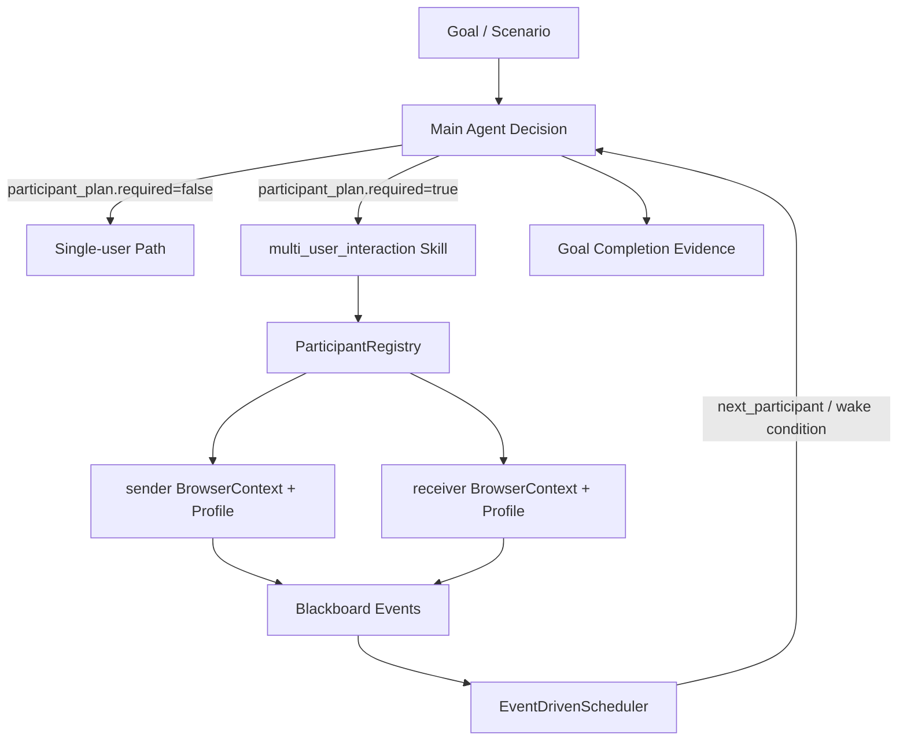
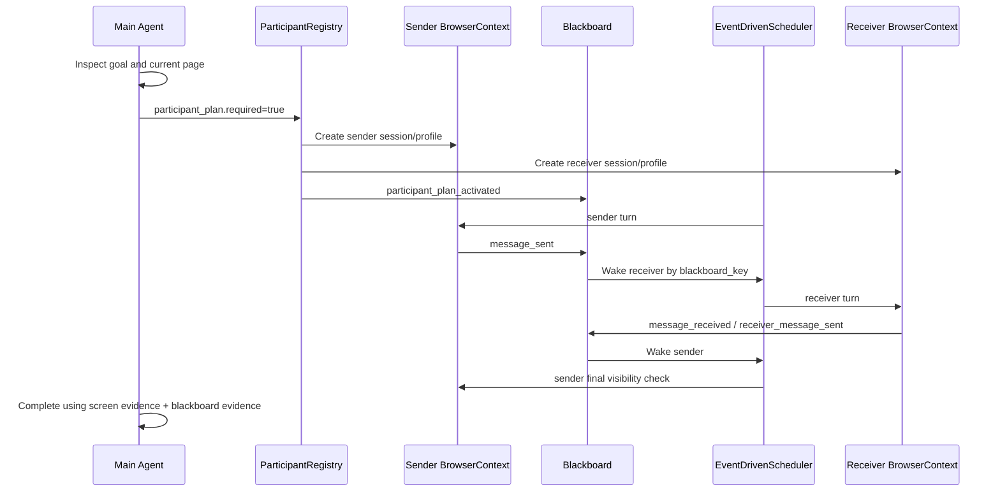

# Multi-User Interaction Harness Architecture

이 문서는 GAIA goal-driven agent가 채팅, 알림, 친구 요청, 승인 흐름처럼 여러 사용자가 동시에 관여하는 기능을 어떻게 실제 QA할 수 있는지 설명한다.

핵심은 프롬프트만으로 "두 명처럼 행동해라"라고 지시하는 방식이 아니다. 메인 에이전트가 다중 참여자가 필요하다고 판단하면 `participant_plan`을 선언하고, 하네스가 그 계획을 실제 독립 브라우저 컨텍스트, event-driven scheduler, blackboard 공유 관찰로 실행한다.

## Problem

일반적인 브라우저 자동화는 한 개의 세션만 가진다. 이 방식으로는 다음 종류의 기능을 제대로 검증하기 어렵다.

- 채팅: sender가 메시지를 보냈을 때 receiver 화면에 도착했는지 확인해야 한다.
- 알림: A의 행동이 B의 알림함에 나타나는지 확인해야 한다.
- 친구 요청: requester가 요청하고 receiver가 수락했을 때 양쪽 상태가 바뀌어야 한다.
- 권한/역할: admin, approver, member처럼 role별 UI와 권한 결과가 달라야 한다.

한 브라우저 탭을 두 개 열어도 충분하지 않다. 최신 웹은 쿠키, localStorage, sessionStorage, service worker, auth token을 같은 브라우저 프로필 안에서 공유할 수 있기 때문이다. 그래서 멀티 유저 QA에는 탭 분리가 아니라 프로필과 BrowserContext 분리가 필요하다.

## Design Goal

이 기능의 설계 목표는 네 가지다.

- 단일 유저 goal은 기존 경로를 그대로 탄다.
- 다중 유저가 필요한 경우에만 메인 에이전트가 skill을 붙인다.
- 참여자 전환은 round-robin이 아니라 causal event 기반으로 일어난다.
- 최종 성공 판정은 한 화면의 버튼 클릭 여부가 아니라 여러 참여자의 관찰 증거와 공유 이벤트를 함께 본다.

## High-Level Architecture



구현상 주요 컴포넌트는 다음과 같다.

- `multi_user_interaction_runtime.py`: skill prompt, participant plan 활성화, participant turn 시작/종료, 계정 요청, 브라우저 컨텍스트 생성/정리.
- `participants/models.py`: `ParticipantPlan`, `ParticipantSpec`, `TurnControl`, `WakeCondition` 같은 계약 모델.
- `participants/registry.py`: goal 실행 동안 참여자, blackboard, scheduler를 묶는 단일 진실원천.
- `participants/blackboard.py`: 참여자들이 관찰한 사실을 append-only 이벤트로 공유하는 in-memory 게시판.
- `participants/turn_scheduler.py`: round-robin이 아닌 event-driven turn scheduler.
- `llm_decision_runtime.py`: decision schema에 `participant_plan`, `participant_id`, `next_participant`, `turn_control`, `blackboard_event`를 노출.
- `decision_parsing_runtime.py`: 모델 응답을 구조화된 `ActionDecision`으로 파싱.
- `goal_achievement_runtime.py`: multi-user blackboard와 현재 화면 증거를 함께 사용해 완료 판정.
- `mcp_openclaw_dispatch_runtime.py`: session/profile 단위로 실제 브라우저 액션을 라우팅.

## Decision Contract

메인 에이전트의 decision schema는 일반 click/fill/wait 외에 다중 참여자 실행에 필요한 필드를 포함한다.

```json
{
  "action": "fill",
  "ref_id": "e12",
  "value": "hello",
  "participant_id": "sender",
  "next_participant": "receiver",
  "turn_control": {
    "status": "wait_for",
    "wait_for": [
      {
        "kind": "blackboard_key",
        "blackboard_key": "message_received",
        "note": "receiver가 메시지를 본 뒤 sender가 다음 검증을 한다"
      }
    ],
    "reason": "sender 메시지 전송 이후 receiver 확인이 필요하다"
  },
  "participant_plan": {
    "skill": "multi_user_interaction",
    "required": true,
    "reason": "채팅 수신 여부는 단일 세션으로 검증할 수 없다",
    "participants": [
      {"id": "sender", "role": "sender"},
      {"id": "receiver", "role": "receiver"}
    ],
    "expected_events": [
      "message_sent",
      "message_received",
      "notification_visible"
    ]
  },
  "blackboard_event": "message_sent",
  "blackboard_payload": {
    "message": "hello"
  }
}
```

중요한 점은 하네스가 버튼 라벨이나 URL만 보고 참여자를 휴리스틱으로 자동 생성하지 않는다는 것이다. 모델이 현재 goal을 보고 `participant_plan.required=true`를 명시해야만 multi-user mode가 켜진다.

## Event-Driven Turn Control

이 시스템은 round-robin이 아니다. `sender -> receiver -> sender -> receiver`를 무조건 반복하지 않는다.

각 participant는 한 step을 실행한 뒤 `turn_control`로 자신의 상태를 선언한다.

- `continue`: 같은 participant가 바로 다음 step을 계속한다.
- `wait_for`: 특정 이벤트가 오기 전까지 idle 상태로 들어간다.
- `done`: 이 participant는 더 이상 행동하지 않는다.

다음 participant는 세 가지 경우에만 실행된다.

- 모델이 `next_participant`로 명시적으로 지명했다.
- `Blackboard`에 새 이벤트가 기록됐고, 어떤 participant의 `WakeCondition`과 매칭됐다.
- deadlock 방지용 timeout이 지나 idle participant를 깨웠다.

이 구조 덕분에 "다른 테스트여도 같은 버튼을 눌러야 하는" 상황을 버튼 단위 memory로 막지 않는다. 버튼이 아니라 비즈니스 이벤트를 기준으로 움직인다. 같은 "전송" 버튼이라도 `sender_message_sent`, `receiver_message_sent`, `notification_visible`처럼 다른 business event를 만들 수 있으면 별개의 의미 있는 action으로 취급된다.

## Blackboard

`Blackboard`는 participant 간 공유 관찰 저장소다. 특정 수신자를 지정하는 DM이 아니라, goal 실행 동안 모두가 읽을 수 있는 append-only event log에 가깝다.

예를 들어 sender가 메시지를 보내면 다음 이벤트를 남긴다.

```json
{
  "participant_id": "sender",
  "key": "message_sent",
  "value": {
    "message": "gaia live sender ping",
    "room": "qa-room",
    "success": true
  },
  "step": 5
}
```

receiver의 프롬프트에는 최근 blackboard summary가 들어간다. 그래서 receiver는 "sender가 이미 메시지를 보냈고, 나는 그 메시지가 내 화면에 보이는지 확인해야 한다"는 문맥을 가진다.

Blackboard는 두 가지 역할을 한다.

- coordination: 다음에 누가 무엇을 해야 하는지 알려준다.
- evidence: 최종 성공 판정 때 여러 화면의 관찰 증거를 모은다.

## Browser Context Isolation

참여자마다 별도 `session_id`와 `profile_name`을 만든다.

예:

- `agent-run::participant::sender`
- `agent-run::participant::receiver`
- `gaia-<digest>-sender`
- `gaia-<digest>-receiver`

이렇게 분리하면 다음 저장소가 섞이지 않는다.

- cookies
- localStorage
- sessionStorage
- auth token
- service worker scope에 묶인 프로필 상태

즉, 같은 사이트에 접속하더라도 sender와 receiver는 실제로 서로 다른 사용자처럼 동작한다.

## Credential Flow

계정 정보가 필요한 사이트에서는 모델이 `participant_plan.credential_requests`를 선언할 수 있다.

```json
{
  "credential_requests": [
    {"participant_id": "sender", "fields": ["username", "password"]},
    {"participant_id": "receiver", "fields": ["username", "password"]}
  ]
}
```

하네스는 누락된 값을 `human_answer`로 요청한다.

요청 필드는 participant id를 prefix로 붙인다.

- `sender_username`
- `sender_password`
- `receiver_username`
- `receiver_password`

값을 받은 뒤에는 각 participant의 `test_data`로만 주입한다. multi-user mode에서는 active participant의 test data만 프롬프트에 넣기 때문에 sender가 receiver의 credential을 보는 식의 오염을 줄인다.

## Runtime Flow



## Completion Logic

멀티유저 goal에서는 한 participant 화면에 목표 텍스트 일부가 보인다는 이유만으로 조기 성공 처리하면 안 된다.

그래서 multi-user mode에서는 단일 화면 target visibility shortcut을 건너뛴다. 대신 성공 판정은 다음 정보를 함께 본다.

- 현재 participant DOM/screenshot에서 보이는 텍스트.
- 이전 participant들이 blackboard에 남긴 이벤트.
- goal의 success criteria나 quoted target terms.
- 모델의 `is_goal_achieved=true` 주장.

예를 들어 채팅 E2E에서는 sender 화면에 ping이 보이는 것만으로는 부족하다. receiver가 같은 방에 들어와 ping을 봤고, pong을 보냈고, 다시 sender 화면에서 pong이 보이는 증거까지 필요하다.

## Real-Site QA Evidence

실제 공개 채팅 사이트 `tlk.io`에서 GPT-5.5 기반으로 검증했다.

실행 결과:

- provider/model: `openai / gpt-5.5`
- room: `https://tlk.io/gaia-live-multi-20260501201633`
- `participant_plan_activated=true`
- sender profile: `gaia-00b0998f-sender`
- receiver profile: `gaia-00b0998f-receiver`
- steps: `12`
- `goal_success=true`
- `all_transcripts_visible=true`

검증된 이벤트:

- `participant_plan_activated`
- `sender_message_sent`
- `receiver_saw_sender_message`
- `receiver_joined`
- `receiver_message_sent`
- `sender_saw_both_messages`
- `receiver_saw_both_messages`

최종 evidence artifact:

- `artifacts/manual/agent_multi_user_tlk_live_gpt55_e2e/manifest.json`
- `artifacts/manual/agent_multi_user_tlk_live_gpt55_e2e/sender_final_tlk_live_gpt55_e2e.png`
- `artifacts/manual/agent_multi_user_tlk_live_gpt55_e2e/receiver_final_tlk_live_gpt55_e2e.png`

`artifacts/`는 source of truth가 아니라 실행 증거 산출물이다. 코드는 `gaia/src/phase4/goal_driven`와 `gaia/src/phase4/participants`가 source of truth다.

## Why This Is Different From Prompt Engineering

프롬프트 엔지니어링만 했다면 모델은 "두 명이 채팅한다고 가정"할 수는 있어도 실제로 두 개의 로그인 상태를 만들고 이벤트를 동기화할 수 없다.

이번 구조는 하네스 엔지니어링이다.

- 모델은 필요한 참여자와 이벤트를 선언한다.
- 하네스는 실제 격리된 브라우저 컨텍스트를 만든다.
- 스케줄러는 이벤트가 발생한 participant만 깨운다.
- blackboard는 참여자 간 관찰을 공유한다.
- completion layer는 여러 화면의 증거를 합쳐 성공을 판정한다.

즉, LLM은 planner/decision maker이고, 하네스는 multi-agent runtime이다.

## Current Limitations

현재 구현은 멀티유저 QA의 V1이다.

- replay executor는 아직 없다.
- blackboard는 현재 in-memory라 run 종료 후 source of truth로 보존되지는 않는다.
- credential은 `human_answer`로 받을 수 있지만, 장기 credential vault는 아니다.
- third-party 사이트는 rate limit, anti-abuse, signup 정책에 따라 실패할 수 있다.
- event naming은 아직 모델이 정하므로 장기적으로는 scenario contract와 연결해 표준화할 필요가 있다.

## Next Steps

추천하는 다음 개선은 세 가지다.

- benchmark scenario에 multi-user expected events를 정식 contract로 추가한다.
- blackboard event를 artifact로 안정 저장해서 replay/debug에 쓰기 좋게 만든다.
- 채팅 외에 알림, 친구 요청, 승인 workflow fixture를 추가해 business-event 기반 QA 범위를 넓힌다.
