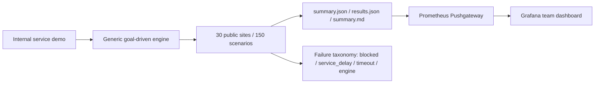

# 중간보고서 그림/스크린샷 소스

작성일: 2026-05-10  
대상 보고서: `docs/harness/MIDTERM_REPORT_SOURCE_2026-05-10.md`  
권장 asset directory: `docs/harness/report_assets/2026-05-midterm/`

이 문서는 중간보고서와 발표자료에 들어갈 그림 후보의 source of truth다. 본문 보고서는 현재 텍스트와 수치 중심이라, 최종 제출본에는 아래 그림 중 6~8개를 골라 넣는 것이 좋다.

## 원칙

- `artifacts/`는 실행 산출물이라 git source of truth가 아니다. 최종 보고서에 쓸 이미지는 선별해서 `docs/harness/report_assets/2026-05-midterm/` 아래에 복사하거나 새로 캡처한다.
- CAPTCHA, 계정 정보, token, cookie, 개인 브라우저 북마크, 터미널 환경변수는 이미지에 노출하지 않는다.
- 실패 사례 화면은 “차단을 우회했다”는 느낌이 들지 않게 CAPTCHA 이미지 자체보다 `BLOCKED_USER_ACTION`, `service_delay`, `http_5xx` 같은 결과 분류 화면을 보여준다.
- Grafana는 source of truth가 아니라 관측 화면이다. 캡션에는 반드시 대응되는 `summary.json`/`results.json` 또는 Pushgateway `pack_id`를 같이 적는다.
- 맥미니 재실행 후 최신 수치가 바뀌면 Grafana 캡처와 표 캡션의 수치를 같이 업데이트한다.

## 최종 보고서 권장 그림 8개

| Figure | 넣을 위치 | 그림 내용 | source/capture 대상 | 권장 파일명 | 상태 |
|---|---|---|---|---|---|
| Fig. 1 | 배경/문제 정의 | 내부 서비스 데모에서 외부 공개 웹 benchmark로 확장된 구조 | Mermaid/diagram 또는 수동 도식 | `fig01_scope_expansion.png` | 생성 필요 |
| Fig. 2 | 벤치마크 설계 | 30개 사이트/150개 시나리오 manifest 요약 | `gaia/tests/scenarios/external_public_manifest.json` | `fig02_external_manifest_30_sites.png` | 생성 필요 |
| Fig. 3 | 실행 흐름 | CLI/terminal에서 benchmark 선택, 지표 확인, Grafana/로컬 선택 메뉴 | `python -m gaia.cli` 또는 `python -m gaia.cli --terminal` 화면 | `fig03_terminal_benchmark_mode.png` | 캡처 필요 |
| Fig. 4 | 팀 공유 | Grafana `External Public 30-site Overview` 상단 | `http://<monitoring-host>:3000/d/gaia-kpi-v1/gaia-benchmark-results` | `fig04_grafana_external_overview.png` | 맥미니 재실행 후 캡처 |
| Fig. 5 | 결과 요약 | site/category별 성공률 테이블 또는 bar chart | Grafana panel 907/908 또는 report table | `fig05_site_category_success.png` | 맥미니 재실행 후 캡처 |
| Fig. 6 | 실패 분석 | reason code 상위 테이블 | Grafana panel 909 또는 Pushgateway metric table | `fig06_reason_code_breakdown.png` | 맥미니 재실행 후 캡처 |
| Fig. 7 | 엔진 보강 | Musinsa 정렬 dropdown의 ref-first/visual fallback 사례 | strict Musinsa rerun artifact 또는 새 headless/visible 캡처 | `fig07_musinsa_visual_fallback.png` | 캡처 필요 |
| Fig. 8 | 정직한 제외 기준 | VisitKorea service delay, blocked commerce, Law.go.kr 상세 오류를 일반 실패와 분리한 표 | report taxonomy 표 또는 sanitized 실패 화면 | `fig08_failure_taxonomy.png` | 생성 필요 |

## 보고서에 바로 넣을 Markdown 스니펫

최종 이미지가 준비되면 본문에는 아래 형태로 넣는다.

```markdown


그림 4. 맥미니에서 `--push-metrics`로 업로드한 external public benchmark의 Grafana overview. 이 화면은 `pack_id=<최신 pack id>`와 같은 실행의 `summary.json`/`results.json`에 대응한다.
```

```markdown


그림 7. Musinsa 정렬 드롭다운에서 option ref가 DOM snapshot에 늦게 반영되는 경우를 stale ref 재수집과 visual coordinate fallback으로 회복한 사례.
```

## Figure별 상세 소스

### Fig. 1. Scope expansion diagram

목적:

- “우리는 내부 사이트 하나에 맞춘 자동화가 아니라 외부 공개 웹 benchmark로 확장했다”를 한 장으로 보여준다.

포함할 요소:

- 내부 서비스 benchmark
- 외부 공개 사이트 30개/150개 시나리오
- GoalDrivenAgent / OpenClaw
- summary/results artifact
- Pushgateway/Grafana
- failure taxonomy

추천 도식:



최종 캡처 방법:

- Markdown/Mermaid를 지원하는 에디터에서 렌더링 후 캡처.
- 또는 발표자료 제작 시 이 구조를 그대로 도형으로 재작성.

### Fig. 2. External manifest 30-site inventory

목적:

- 교수님이 “내부 사이트 휴리스틱일 수 있다”고 지적한 부분에 대한 직접 반박 자료.
- 30개 사이트와 카테고리 분포를 시각적으로 보여준다.

source:

- `gaia/tests/scenarios/external_public_manifest.json`
- `docs/harness/MIDTERM_REPORT_SOURCE_2026-05-10.md` Appendix A

캡처/생성 후보:

```bash
PYTHONPATH=. python - <<'PY'
import json
from pathlib import Path

manifest = json.loads(Path("gaia/tests/scenarios/external_public_manifest.json").read_text())
for item in manifest["suites"]:
    print(f'{item["site_key"]:18} {item["category"]:24} {item["label"]}')
PY
```

보고서 캡션:

> 그림 2. 외부 공개 benchmark manifest. 30개 사이트를 포털/뉴스, 커머스, 공공데이터, 개발자 문서, 문화/취업 등으로 분산해 내부 서비스 전용 휴리스틱 가능성을 줄였다.

### Fig. 3. Terminal benchmark mode

목적:

- 팀원들이 GUI 없이도 benchmark를 실행하고 지표를 확인할 수 있음을 보여준다.
- 사용자가 요구했던 방향키 선택형 UX와 Grafana/로컬 지표 선택 흐름을 시각화한다.

source:

- `gaia/src/terminal_benchmark_mode.py`
- `python -m gaia.cli` 실행 화면

캡처 대상:

- benchmark 대상 선택 화면
- `기존 테스트 실행`, `테스트 편집`, `지표 확인`, `새로운 테스트 추가` 메뉴
- `지표 확인 위치를 선택하세요`에서 `Grafana 열기`, `로컬 결과 보기`, `실패 기록 삭제`, `이전으로`가 보이는 화면

주의:

- 터미널에 token, API key, local username이 보이면 crop 또는 redaction한다.

### Fig. 4. Grafana external 30-site overview

목적:

- 팀 공유 지표가 실제로 Grafana에 올라간다는 증거.
- 30개 사이트 전체 성공률, primary 성공률, 평균 시간, 개입률을 한 화면에 보여준다.

source:

- Dashboard JSON: `monitoring/grafana/dashboards/gaia_kpi.json`
- Dashboard UID: `gaia-kpi-v1`
- URL shape: `http://<monitoring-host>:3000/d/gaia-kpi-v1/gaia-benchmark-results`

현재 확인된 서버 snapshot:

- `pack_id`: `kpi_pack_20260508_235814`
- Push time: `2026-05-09 02:15:12 KST`
- `runs_total`: 150
- `success_count`: 141
- `success_rate`: 0.94
- `primary_success_rate`: 0.94
- Caveat: VisitKorea 제거/정책브리핑 대체 전 snapshot.

맥미니 재실행 후 캡처 절차:

1. 맥미니에서 최신 브랜치로 이동.
2. 최신 manifest로 전체 benchmark 실행.
3. `--push-metrics` 성공 확인.
4. Grafana에서 `External Public 30-site Overview` row가 보이도록 캡처.
5. 캡션에 최신 `pack_id`, 실행 시각, success rate를 적는다.

실행 명령:

```bash
PYTHONPATH=. GAIA_OPENCLAW_HEADLESS=1 GAIA_LLM_MODEL=gpt-5.5 GAIA_RAIL_ENABLED=0 \
GAIA_RUNNER_ID=macmini-team-a \
python scripts/run_kpi_benchmark_pack.py \
  --suite-manifest gaia/tests/scenarios/external_public_manifest.json \
  --repeats 1 \
  --timeout-cap 600 \
  --session-prefix external-public-final-20260510 \
  --runner-id macmini-team-a \
  --push-metrics
```

### Fig. 5. Site/category success table

목적:

- 전체 성공률만 제시하면 “어떤 사이트에서 잘 되고 안 되는지”가 묻히므로, 사이트/카테고리별 분포를 보여준다.

source:

- Grafana panel:
  - `사이트별 성공률 / 실행 시간 / 차단 수`
  - `카테고리별 성공률`
- Metric:
  - `gaia_external_site_success_rate`
  - `gaia_external_category_success_rate`

보고서에서 강조할 점:

- 커머스, 포털/뉴스, 공공데이터, 개발자 문서, 문화/취업 등 서로 다른 구조의 웹에서 평가했다.
- 실패 사이트를 숨긴 것이 아니라 category/site별로 분리해 기록했다.

### Fig. 6. Reason code breakdown

목적:

- 실패가 전부 “엔진이 못함”이 아니라 service delay, blocked, missing element, timeout 등으로 분류됨을 보여준다.

source:

- Grafana panel: `실패 Reason Code 상위`
- Metric:
  - `gaia_external_reason_code_count`
  - `gaia_external_site_reason_code_count`
- Code:
  - `scripts/benchmark_blocking.py`
  - `scripts/push_metrics.py`

주의:

- `ok`, `weak_effective_ignored`, `rail_skipped_disabled` 같은 내부 이벤트성 reason은 발표에서 그대로 길게 설명하지 말고, “성공/보수적 무시/rail disabled marker”처럼 묶어 설명한다.
- CAPTCHA 화면 자체를 보여주기보다 `BLOCKED_USER_ACTION`으로 분리했다는 표를 보여준다.

### Fig. 7. Musinsa visual fallback example

목적:

- 사람에게 쉬운 UI라도 자동화 엔진에는 ref stale, option ref 누락, DOM 반영 지연 문제가 생길 수 있음을 보여준다.
- 이번 보강이 단순 성공률 튜닝이 아니라 실제 웹 UI 구조 대응이었다는 증거.

source:

- Suite:
  - `gaia/tests/scenarios/musinsa_sort_strict_suite.json`
  - `gaia/tests/scenarios/musinsa_public_suite.json`
- 관련 code:
  - `gaia/src/phase4/goal_driven/agent.py`
  - `gaia/src/phase4/goal_driven/action_execution_runtime.py`
  - `gaia/src/phase4/goal_driven/llm_decision_runtime.py`
- 관련 marker:
  - `visual_coordinate_fallback`
  - `dom_force_resnapshot_stale_dom_wait`
  - `missing_element_id`

캡처 구성:

- 왼쪽: 정렬 드롭다운 `무신사 추천순`이 열린 화면.
- 오른쪽: `낮은 가격순` 선택 후 URL 또는 버튼 텍스트가 바뀐 화면.
- 캡션에는 “ref-first, stale DOM refresh, visual fallback”을 넣는다.

### Fig. 8. Failure taxonomy / 제거 기준

목적:

- “성공률을 올리려고 빼버린 것 아니냐”는 질문에 대비한다.
- 제거 기준이 임의가 아니라 측정 의미가 없는 site unavailable / bot wall / service delay였음을 보여준다.

source:

- `docs/harness/MIDTERM_REPORT_SOURCE_2026-05-10.md`의 failure taxonomy 섹션.
- `scripts/benchmark_blocking.py`
- 변경된 manifest:
  - `gaia/tests/scenarios/external_public_manifest.json`

표에 넣을 예:

| 케이스 | 분류 | 처리 |
|---|---|---|
| VisitKorea 서비스 지연 안내 반복 | `service_delay` / `site_unavailable` | 정책브리핑으로 대체 |
| CAPTCHA/bot-wall 반복 사이트 | `BLOCKED_USER_ACTION` | primary pack에서 제외 |
| Law.go.kr 상세 iframe 불안정 | `site_volatility` / `http_5xx` | 안정 URL/탭 구조로 교체 |
| Musinsa option ref 누락 | `engine_recovery_case` | stale ref refresh + visual fallback |

## 맥미니 재실행 후 업데이트할 값

맥미니에서 다시 돌린 뒤 아래 항목을 업데이트한다.

| 항목 | 업데이트 위치 |
|---|---|
| 최신 `pack_id` | 이 파일 Fig. 4, 중간보고서 Appendix L |
| latest push time KST | 이 파일 Fig. 4, 중간보고서 Appendix L |
| success / primary success rate | 이 파일 Fig. 4/5, 중간보고서 결과 표 |
| 실패 site 목록 | 이 파일 Fig. 5/8, 중간보고서 failure taxonomy |
| reason code top N | 이 파일 Fig. 6, 중간보고서 Appendix L |
| Grafana screenshot filename | 이 파일 상단 표, 최종 보고서 본문 |

## 이미지 파일명 규칙

- prefix는 `figNN_` 형태로 고정한다.
- 날짜는 같은 그림을 여러 번 갱신할 때만 뒤에 붙인다.
- 캡션과 alt text에 수치가 들어가면, 이미지 갱신 시 캡션 수치도 반드시 같이 바꾼다.

예:

- `fig04_grafana_external_overview.png`
- `fig05_site_category_success.png`
- `fig06_reason_code_breakdown.png`
- `fig07_musinsa_visual_fallback.png`

## 최종 제출 전 체크리스트

- [ ] 이미지에 API key/token/cookie/account 정보가 없다.
- [ ] Grafana 화면의 `pack_id`가 본문 수치와 일치한다.
- [ ] `summary.json`/`results.json` artifact 경로를 캡션 또는 본문에 적었다.
- [ ] CAPTCHA 원본 이미지를 우회/해결 대상으로 보이게 넣지 않았다.
- [ ] `artifacts/` 원시 경로가 아니라 `docs/harness/report_assets/2026-05-midterm/` 아래 curated asset을 사용한다.
- [ ] 최종 발표자료에서는 그림마다 “무엇을 증명하는지” 한 문장씩 붙였다.
