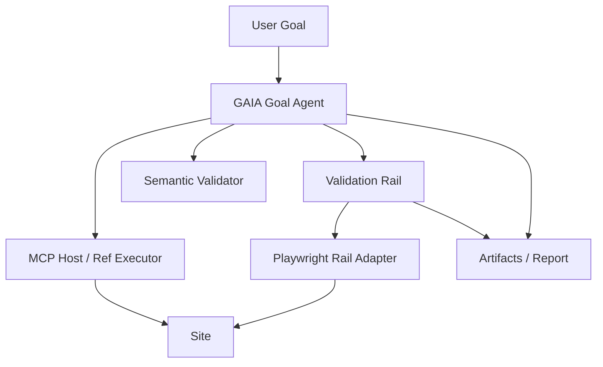

# GAIA Playwright Skill 이식 설계서

## 1. 목적

이 문서는 Codex의 `playwright` 스킬에 포함된 운영 규칙을 GAIA에 이식하는 방안을 정리한다.

핵심 목표는 다음 3가지다.

1. GAIA의 실행 신뢰성을 높인다.
2. 디버그/검증 레일을 강화한다.
3. 주 실행 엔진을 흔들지 않고, Playwright 기반 관측 능력을 보강한다.

이 문서에서 말하는 "이식"은 `SKILL.md` 자체를 복사하는 것이 아니라, 스킬에 들어 있는 절차와 정책을 GAIA 구조에 맞게 코드/모드로 옮기는 것을 뜻한다.

---

## 2. Playwright 스킬의 본질

현재 Codex `playwright` 스킬의 핵심은 다음 절차다.

1. 브라우저를 연다.
2. `snapshot`을 찍어 안정적인 element ref를 확보한다.
3. ref 기반으로 click/fill/press를 수행한다.
4. 화면이 바뀌면 다시 `snapshot`을 찍는다.
5. 필요 시 screenshot/trace를 남긴다.

즉, 이 스킬은 "브라우저 조작 기능"이라기보다 다음을 포함한 운영 규칙이다.

- stale ref를 피하기 위한 재스냅샷 규칙
- DOM 변화 이후 재탐색 규칙
- 디버그용 artifact 수집 규칙
- CLI 기반 수동/반자동 브라우저 디버깅 규칙

이 철학은 이미 GAIA의 `snapshot + ref + reason_code` 구조와 잘 맞는다.

---

## 3. GAIA 현재 구조와의 정렬도

### 3.1 이미 정렬된 부분

GAIA는 이미 아래를 갖고 있다.

- snapshot 기반 실행
- ref-only action 계약
- stale snapshot/ref 감지 및 복구
- fallback/retry/reason_code/state_change 기록
- blocked user action 처리
- semantic validation 일부 도입

즉, Playwright 스킬의 기본 철학과 충돌하지 않는다.

### 3.2 아직 부족한 부분

Playwright 스킬 기준으로 보면 GAIA에 부족한 것은 아래다.

1. 독립적인 검증 레일
- 주 실행 결과를 별도 Playwright 흐름으로 재검증하는 레이어가 약함

2. 디버그 절차 표준화
- 특정 실패를 재현할 때 어떤 순서로 snapshot/click/screenshot을 남길지 고정돼 있지 않음

3. artifact 수집의 일관성
- 실행 중 어디서 어떤 이미지를 남길지 정책이 약함

4. 인터랙티브 브라우저 조사 모드
- "실행 엔진"과 "사람이 추적하는 디버그 모드"가 충분히 분리돼 있지 않음

---

## 4. 이식 방향 결론

결론부터 말하면, Playwright 스킬은 GAIA의 **주 실행 엔진**으로 넣는 것보다 **검증 레일 + 디버그 모드**로 넣는 것이 맞다.

### 4.1 권장안

1. 주 실행 엔진
- 기존 MCP host + ref-only 실행 유지

2. 보조 검증 레일
- Playwright CLI 또는 Playwright Python을 사용해 사후 검증 수행

3. 디버그 모드
- 특정 실패를 재현할 때 snapshot 중심으로 따라가는 관측 모드 제공

### 4.2 비권장안

Playwright 스킬을 주 엔진으로 이중화하는 방식은 비권장이다.

이유:

- 브라우저 제어 경로가 2개가 되면 디버깅이 어려워짐
- 성공/실패 기준이 엔진마다 달라질 수 있음
- 유지보수 포인트가 증가함
- reason_code와 state_change를 한 군데에서 일관되게 관리하기 어려움

---

## 5. 이식 대상 정책

Playwright 스킬에서 가져올 수 있는 정책은 아래 5개다.

### 5.1 Snapshot-before-action

정책:
- ref를 사용하기 전 fresh snapshot 확보

GAIA 적용:
- 이미 대부분 적용돼 있음
- 보강 포인트는 "stale이 아님에도 오래된 snapshot" 사용을 더 엄격히 제한하는 것

장점:
- not_actionable/stale 감소

단점:
- snapshot 횟수 증가로 속도 저하 가능

권장:
- default on
- read-only verification rail에서도 동일 적용

### 5.2 Resnapshot-after-UI-change

정책:
- navigation, modal open/close, tab switch, large DOM mutation 뒤에는 resnapshot

GAIA 적용:
- 현재도 부분 반영
- 더 명시적으로 "강한 상태 변화 strong progress"에서 무조건 재스냅샷 연결 필요

장점:
- stale ref 방지
- 루프 감소

단점:
- snapshot 오버헤드

권장:
- strong progress에만 강제
- weak progress에는 적용 금지

### 5.3 Stable artifact collection

정책:
- screenshot/trace를 고정된 위치에 저장

GAIA 적용:
- `/Users/coldmans/Documents/GitHub/capston/gaia/artifacts/`
  하위에 run 단위 저장 규칙 통일

장점:
- 발표/리뷰/재현이 쉬움

단점:
- artifact 양 증가

권장:
- success/fail/blocked 각각 대표 이미지 1장 이상
- smoke rail은 최대 3장

### 5.4 Interactive debug workflow

정책:
- open -> snapshot -> ref action -> snapshot 루프를 사람이 직접 디버그용으로 쓸 수 있게 제공

GAIA 적용:
- `rail debug`
- `rail inspect`
- `rail snapshot`
같은 운영 명령으로 노출 가능

장점:
- 코드 버그와 사이트 버그 구분이 빨라짐

단점:
- 제품 기능이라기보다 운영 기능

권장:
- 개발자 전용 모드로 유지

### 5.5 Ref-first discipline

정책:
- 임의 eval/run-code 대신 ref/snapshot 기반 조작 우선

GAIA 적용:
- 이미 핵심 철학
- validation rail에서도 selector 우회보다 ref 또는 deterministic locator를 우선

장점:
- 재현성 상승

단점:
- 초기 구현 비용

권장:
- 계속 유지

---

## 6. GAIA와 Playwright Skill의 정책 차이

### 6.1 현재 GAIA 정책

- Master/Worker 구조
- 목표 기반 계획
- reason_code/state_change 중심
- blocked user action/handoff
- semantic validator 확장 중

### 6.2 Playwright Skill 정책

- 인간 조작에 가까운 CLI 워크플로
- snapshot/ref 안정성 우선
- 테스트 코드보다 live debug 우선
- 관측과 증빙 중시

### 6.3 차이의 장단점

#### GAIA 장점

- 자율 목표 수행 가능
- 복구 정책(reason_code, fallback, resnapshot)이 풍부함
- 사용자 입력/steering/handoff와 결합 가능

#### GAIA 단점

- 복잡해서 병목 원인 분리가 어려울 수 있음
- 조기 성공/오탐 같은 정책 실수가 생길 수 있음

#### Playwright Skill 장점

- 디버그 절차가 단순하고 재현이 쉬움
- 사람이 개입해 원인 추적하기 좋음

#### Playwright Skill 단점

- 자율성은 거의 없음
- 목표 계획/의미 검증은 스스로 하지 않음

정리:
- GAIA는 "자율 실행 엔진"
- Playwright Skill은 "상호작용형 디버그/검증 절차"

둘은 대체 관계가 아니라 상호 보완 관계다.

---

## 7. 아키텍처 제안

핵심은 아래다.

- 주 실행은 계속 `MCP Host / Ref Executor`
- Playwright는 `Validation Rail` 또는 `Debug Rail`
- 둘 다 같은 report/reason_code 스키마로 귀결

---

## 8. 구현 방식 3안

### 안 A. Playwright CLI 래퍼 연동

개념:
- Codex skill처럼 `playwright-cli`를 외부 프로세스로 실행

예상 파일:
- `/Users/coldmans/Documents/GitHub/capston/gaia/src/phase4/playwright_cli_adapter.py`
- `/Users/coldmans/Documents/GitHub/capston/gaia/src/phase4/validation_rail.py`

장점:
- skill 철학과 가장 유사
- 개발자 디버그에 좋음

단점:
- 외부 프로세스 파싱 비용
- 응답 포맷 안정화 필요

추천도:
- 중간

### 안 B. Playwright Python 직접 연동

개념:
- `playwright.async_api`로 validation rail을 직접 작성

예상 파일:
- `/Users/coldmans/Documents/GitHub/capston/gaia/src/phase4/playwright_rail_adapter.py`

장점:
- Python 코드와 자연스럽게 통합
- 결과 스키마 통제 쉬움
- timeout/retry/logging 직접 관리 가능

단점:
- skill 자체의 CLI UX는 약해짐

추천도:
- 높음

### 안 C. Playwright CLI + Python 혼합

개념:
- 기본 rail은 Python
- 개발자 수동 디버그용으로만 CLI 래퍼 제공

장점:
- 제품/운영 둘 다 챙길 수 있음

단점:
- 구현량 증가

추천도:
- 최종형

결론:
- 단기: 안 B
- 중기: 안 C

---

## 9. GAIA에 넣어야 할 구성 요소

### 9.1 `PlaywrightRailAdapter`

책임:
- open
- snapshot
- click
- fill
- select
- screenshot
- current_url
- extract_text

권장 위치:
- `/Users/coldmans/Documents/GitHub/capston/gaia/src/phase4/playwright_rail_adapter.py`

### 9.2 `RailCase`

책임:
- smoke/full/debug 구분
- 각 케이스의 goal, precondition, assertions 정의

권장 위치:
- `/Users/coldmans/Documents/GitHub/capston/gaia/src/phase4/rail_cases.py`

### 9.3 `ArtifactPolicy`

책임:
- 언제 screenshot을 남길지
- 어느 경로에 저장할지

권장 위치:
- `/Users/coldmans/Documents/GitHub/capston/gaia/src/phase4/rail_artifacts.py`

### 9.4 `RailReporter`

책임:
- GAIA report schema와 동일한 구조로 출력

권장 위치:
- `/Users/coldmans/Documents/GitHub/capston/gaia/src/phase4/rail_reporter.py`

---

## 10. 우선 이식해야 할 부족한 점

Playwright 스킬을 기준으로 볼 때, GAIA에 가장 먼저 이식할 만한 부족점은 아래 순서다.

### 10.1 독립 검증 레일

가장 먼저 필요하다.

이유:
- 주 실행이 성공했다고 끝내면 오탐을 잡기 어렵다.
- 별도 rail이 있으면 “에이전트가 성공이라 했는데 실제 UI가 맞는가”를 따로 확인 가능하다.

예:
- 학점 필터 검증
- 위시리스트 비우기
- 조합 만들기 결과 적용

### 10.2 디버그 snapshot 절차 고정

실패 재현 시:

1. open
2. snapshot
3. problematic click
4. snapshot
5. screenshot
6. trace 저장

이 절차를 표준화하면 팀원이 바뀌어도 같은 방식으로 디버그할 수 있다.

### 10.3 artifact 표준화

현재는 이미지/로그가 흩어질 수 있다.
이를 run 기준으로 고정해야 한다.

권장 경로:
- `/Users/coldmans/Documents/GitHub/capston/gaia/artifacts/validation-rail/<run_id>/`

---

## 11. 정책별 장단점 분석

### 11.1 주 실행 엔진에 직접 통합

장점:
- 엔진 하나로 통일
- 실행/검증이 한 흐름에 있음

단점:
- Playwright와 MCP host가 섞여 복잡해짐
- root cause 분리 어려움

판단:
- 비추천

### 11.2 별도 validation rail로 분리

장점:
- 책임 분리 명확
- 발표에서 "독립 검증 레일"로 설명 가능
- 오탐 탐지에 강함

단점:
- 실행 시간이 늘 수 있음

판단:
- 강력 추천

### 11.3 개발자 디버그 전용 모드만 도입

장점:
- 구현이 가장 빠름
- 운영 부담 적음

단점:
- 제품 가치 증명이 약함

판단:
- 단기 보완책으로는 가능
- 최종 발표용으로는 부족

---

## 12. 추천 최종 구조

### Phase 1

목표:
- validation rail 최소 버전

구현:
- smoke 3개
  - modal close
  - credit filter
  - wishlist clear

### Phase 2

목표:
- semantic validator와 rail 연결

구현:
- rail 결과를 GAIA report에 합치기
- Telegram/CLI에 요약 표시

### Phase 3

목표:
- debug rail 추가

구현:
- `/rail debug`
- `/rail smoke`
- `/rail full`

---

## 13. 발표 관점에서의 가치

이 구조는 졸업작품 발표에서 아래 메시지를 만들 수 있다.

1. GAIA는 단순 자동 클릭기가 아니다.
2. 목표 기반 실행과 독립 검증 레일을 분리한 구조다.
3. 실패 시 원인 분석이 가능하고, 성공 시에도 재검증이 가능하다.
4. 즉, "동작하는 데모"가 아니라 "검증 가능한 에이전트 시스템"이다.

이 메시지는 발표 평가에서 강하다.

---

## 14. 최종 권고

### 하지 말 것

- Playwright skill을 주 실행 엔진으로 통째로 대체
- MCP host와 Playwright를 한 action path 안에 억지로 혼합
- 도메인별 커스텀 규칙부터 늘리기

### 할 것

1. Playwright 기반 validation rail 도입
2. debug rail 추가
3. artifact/report 표준화
4. semantic validator와 rail 결과 결합

### 한 줄 결론

Playwright 스킬은 GAIA의 부족한 점을 메우는 데 유효하지만, **주 실행 엔진**이 아니라 **검증 레일 + 디버그 레일**로 이식할 때 가장 효과적이다.
