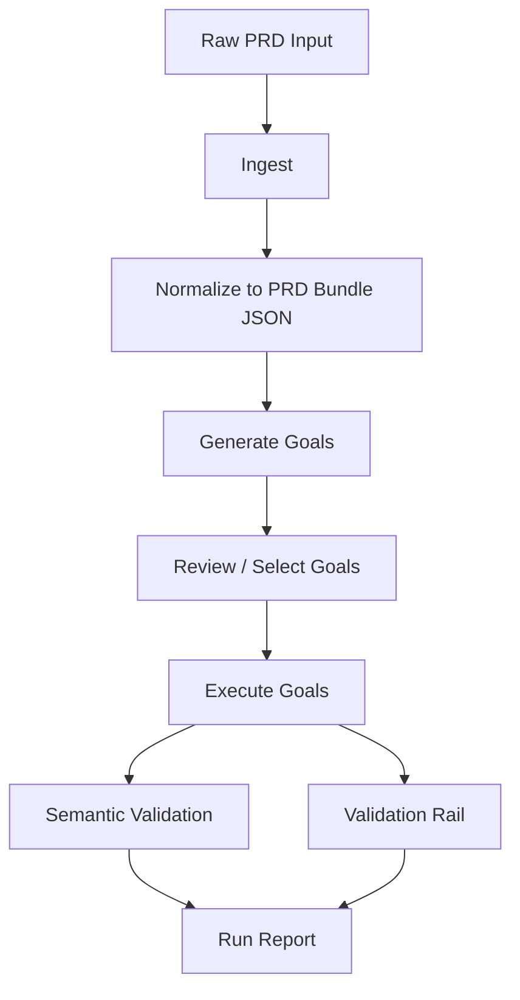

# GAIA PRD Bundle Mode 설계서

## 1. 목적

이 문서는 GAIA에 `기획서 -> 테스트 목표 생성 -> 테스트 실행` 3단계 프로세스를 범용적으로 도입하기 위한 설계서다.

핵심 원칙은 아래와 같다.

1. 입력 문서 형식은 가정하지 않는다.
2. 어떤 형식이 들어와도 먼저 `정규화 JSON`으로 변환한다.
3. 이후 실행은 원본 문서가 아니라 `PRD Bundle JSON`을 기준으로 반복 수행한다.
4. GUI를 메인 UX로 두되, CLI도 동일 계약을 사용한다.

---

## 2. 문제 정의

현재 GAIA는 다음 흐름이 부분적으로만 존재한다.

1. `spec` 또는 `plan` 파일을 받는다.
2. 시나리오를 생성한다.
3. 실행한다.

하지만 최종 발표용 시스템으로 보기엔 아래 한계가 있다.

1. 입력 문서 형식이 사실상 PDF 중심이다.
2. 원본 문서에서 어떤 요구사항이 어떤 목표로 변환됐는지 추적성이 약하다.
3. 다음번 실행 때 동일한 의미로 재사용하는 구조가 약하다.
4. GUI가 “기획서 기반 테스트 운영기”가 아니라 “PDF 업로더 + 실행기”처럼 보인다.

따라서 GAIA는 이제 `spec mode`가 아니라 `PRD Bundle mode`로 재정리되어야 한다.

---

## 3. 최종 사용자 경험

최종 사용자 경험은 아래 3단계로 고정한다.

### 3.1 1단계: 기획서 입력

사용자는 아래 중 하나를 제공한다.

- PDF
- DOCX
- Markdown
- TXT
- 붙여넣기 텍스트
- 이미 생성된 PRD Bundle JSON

### 3.2 2단계: 테스트 목표 생성

GAIA는 입력 문서를 분석해 다음을 만든다.

- 구조화된 PRD 정보
- 기능 요구사항 목록
- 사용자 흐름 목록
- 우선순위(P0/P1/P2)
- 실행 가능한 테스트 목표(goal) 목록

사용자는 이 단계에서 목표를 검토하고 선택/제외할 수 있다.

### 3.3 3단계: 테스트 실행

사용자는 이후부터 원본 문서가 아니라 `bundle.json`만 다시 선택하면 된다.

즉:

1. 한 번만 정규화
2. 이후는 번들 재사용
3. 필요할 때만 목표 재생성

이 흐름이 발표에서 가장 중요하다.

---

## 4. 최종 아키텍처



핵심은 실행 전에 반드시 `PRD Bundle JSON`이 생긴다는 점이다.

---

## 5. 왜 JSON Bundle이 맞는가

이 설계에서 가장 중요한 결정은 “다음 실행부터는 JSON만 선택한다”는 것이다.

이 방식의 장점은 아래와 같다.

1. 범용성
- 원본 형식이 달라도 실행 엔진은 한 가지 스키마만 본다.

2. 재현성
- 같은 bundle을 사용하면 같은 목표 집합을 반복 실행할 수 있다.

3. 추적성
- 각 목표가 어떤 요구사항에서 나왔는지 기록할 수 있다.

4. UX 단순화
- 사용자는 다음번에 PDF를 다시 넣지 않고 JSON만 열면 된다.

5. 발표 적합성
- “문서 입력 -> 번들 생성 -> 반복 실행”이라는 구조가 명확하다.

---

## 6. Bundle을 단일 진실원으로 삼되, 실행 결과는 분리

여기서 중요한 정책이 하나 있다.

### 6.1 Bundle은 가능한 한 불변에 가깝게 유지

권장:

- bundle.json에는 정규화된 PRD와 목표 정의만 저장
- 실행 결과는 별도 run artifact로 저장

비권장:

- bundle.json에 매번 run 결과를 덮어쓰기

이유:

1. 재현성 유지
2. diff/리뷰가 쉬움
3. 실행 로그와 설계 자산을 분리 가능

따라서 bundle은 “설계 자산”, run result는 “실행 자산”으로 나눈다.

---

## 7. PRD Bundle v1 JSON 스키마

권장 파일명:

- `*.prd_bundle.json`

최상위 스키마:

```json
{
  "schema_version": "gaia.prd_bundle.v1",
  "bundle_id": "inuu_timetable_20260306_001",
  "project": {
    "name": "INU Timetable",
    "description": "수강 시간표 탐색/조합/확정 웹 서비스"
  },
  "source": {
    "input_type": "text",
    "source_path": null,
    "source_hash": "sha256:...",
    "created_at": "2026-03-06T10:30:00+09:00",
    "language": "ko"
  },
  "normalized_prd": {
    "summary": "",
    "problem_statements": [],
    "target_users": [],
    "value_propositions": [],
    "user_flows": [],
    "functional_requirements": [],
    "non_functional_requirements": [],
    "data_contracts": [],
    "kpis": [],
    "release_priorities": [],
    "risks": []
  },
  "generated_goals": [],
  "execution_profile": {
    "default_url": "",
    "auth_policy": "user_or_saved",
    "runtime": "gui",
    "validation_mode": "semantic_plus_rail",
    "rail_scope": "smoke"
  },
  "metadata": {
    "generator": "gaia",
    "generator_version": "v1",
    "notes": []
  }
}
```

---

## 8. `normalized_prd` 세부 구조

### 8.1 Functional Requirement

```json
{
  "req_id": "FR-6.2",
  "title": "과목 탐색",
  "priority": "P0",
  "description": "과목 목록 조회, 검색, 필터, 페이지 이동 제공",
  "acceptance_hints": [
    "검색 키워드 입력 가능",
    "학점/구분 필터 가능",
    "다음 페이지 이동 가능"
  ]
}
```

### 8.2 User Flow

```json
{
  "flow_id": "FLOW-A",
  "name": "신입생/저학년 기본 플로우",
  "steps": [
    "로그인",
    "과목 탐색",
    "위시리스트 추가",
    "조합 생성",
    "시간표 확정"
  ]
}
```

### 8.3 KPI

```json
{
  "kpi_id": "KPI-3",
  "name": "조합 생성 완료율",
  "operator": ">=",
  "target_value": 95,
  "unit": "%"
}
```

---

## 9. `generated_goals` 스키마

이 영역이 실행 엔진과 직접 연결된다.

```json
{
  "goal_id": "FR-6.2-credit-filter",
  "title": "학점 필터 동작 검증",
  "priority": "P0",
  "goal_type": "feature_validation",
  "goal_text": "학점 필터가 결과 목록과 페이지 이동 후에도 유지되는지 검증한다.",
  "source_refs": [
    "FR-6.2",
    "FLOW-B"
  ],
  "preconditions": [
    "메인 페이지 접근 가능"
  ],
  "success_contract": {
    "kind": "filter_validation_semantic",
    "required_checks": [
      "selection_reflected",
      "page1_consistency",
      "persistence_check"
    ]
  },
  "rail_tags": [
    "smoke",
    "filter"
  ],
  "enabled": true
}
```

---

## 10. Goal 생성 원칙

Goal 생성은 문서를 그대로 step으로 바꾸는 방식이 아니라, 요구사항을 실행 가능한 검증 목표로 바꾸는 방식이어야 한다.

예:

### 나쁜 예
- “과목 검색을 지원해야 한다”

### 좋은 예
- “키워드 검색 후 결과 목록이 관련 과목으로 갱신되는지 검증한다”

따라서 생성기는 아래 규칙을 따라야 한다.

1. 하나의 goal은 하나의 검증 의미를 가져야 한다.
2. goal은 실행 가능한 성공 계약을 가져야 한다.
3. goal은 source requirement를 참조해야 한다.
4. goal은 priority를 가져야 한다.
5. goal은 rail 태그를 가져야 한다.

---

## 11. 범용 입력 처리 방식

입력 형식을 예측하지 않는다고 했으므로, ingest 계층은 다음 정책으로 간다.

### 11.1 입력 타입 감지

- `.pdf` -> PDF extractor
- `.docx` -> DOCX extractor
- `.md`, `.txt` -> plain text loader
- `.json` -> bundle 또는 raw json 판별
- 직접 입력 -> raw text

### 11.2 공통 산출물

어떤 입력이든 먼저 아래 구조로 바꾼다.

```json
{
  "input_type": "pdf|docx|markdown|text|json",
  "raw_text": "...",
  "source_path": "...",
  "source_hash": "...",
  "language": "ko"
}
```

그 다음 normalize 단계에서 LLM이 `normalized_prd`를 만든다.

---

## 12. Normalize 단계 정책

Normalize 단계는 가장 중요하다.

이 단계의 책임:

1. 문서를 그대로 복사하지 않는다.
2. 의미 단위로 정리한다.
3. 누락/모호함은 notes로 남긴다.
4. 실행과 직접 관련 없는 장황한 문장은 summary로 축약한다.

정리 대상:

- 서비스 개요
- 문제 정의
- 사용자 시나리오
- 기능 요구사항
- 비기능 요구사항
- KPI
- 우선순위
- 리스크

Normalize 단계 결과는 사람이 읽어도 “기획서 요약본”이어야 하고, 실행 엔진이 봐도 “기계가 읽을 수 있는 구조”여야 한다.

---

## 13. 실행 단계 정책

Bundle 실행 시에는 아래만 본다.

1. `generated_goals`
2. `execution_profile`
3. 사용자가 고른 goal subset

즉, 실행 엔진은 원본 문서나 raw text를 다시 보지 않는다.

이게 중요하다.

왜냐면 매 실행마다 원문을 다시 해석하면 재현성이 떨어지기 때문이다.

---

## 14. CLI 설계

CLI는 아래 4개 명령이면 충분하다.

### 14.1 `gaia prd ingest`

역할:
- 문서를 읽고 PRD Bundle JSON 생성

예:

```bash
gaia prd ingest --input ./inu_prd.pdf --output ./inu_timetable.prd_bundle.json
gaia prd ingest --input ./prd.md --output ./bundle.json
gaia prd ingest --text-file ./prd.txt --output ./bundle.json
```

옵션:

- `--input <path>`
- `--text-file <path>`
- `--output <bundle.json>`
- `--project-name <name>`
- `--url <default-url>`

### 14.2 `gaia prd inspect`

역할:
- bundle 내용을 읽기 좋게 요약

예:

```bash
gaia prd inspect --bundle ./inu_timetable.prd_bundle.json
```

출력:

- 프로젝트명
- 요구사항 수
- 생성된 goal 수
- P0/P1/P2 분포
- enabled goal 목록

### 14.3 `gaia prd run`

역할:
- bundle에서 goal 읽어 실행

예:

```bash
gaia prd run --bundle ./inu_timetable.prd_bundle.json
gaia prd run --bundle ./inu_timetable.prd_bundle.json --goal FR-6.2-credit-filter
gaia prd run --bundle ./inu_timetable.prd_bundle.json --only-p0
```

옵션:

- `--bundle <path>`
- `--goal <goal_id>`
- `--only-p0`
- `--url <override-url>`
- `--runtime gui|terminal`

### 14.4 `gaia prd refresh-goals`

역할:
- normalized_prd는 유지하고 generated_goals만 재생성

예:

```bash
gaia prd refresh-goals --bundle ./inu_timetable.prd_bundle.json
```

이 명령이 있어야 “기획서는 유지, goal 생성 규칙만 개선”이 가능하다.

---

## 15. GUI 설계

GUI는 이제 “PDF 드롭 화면”이 아니라 “PRD Bundle 중심 3단계 위저드”로 바뀌어야 한다.

### 15.1 메인 홈 화면

메인 CTA는 아래 3개다.

1. `새 기획서 번들 만들기`
2. `기존 번들 열기`
3. `최근 실행 보기`

현재처럼 “PDF 드래그”가 최상단 CTA가 되면 안 된다.

### 15.2 1단계 화면: 기획서 입력

입력 방식:

- 파일 선택
- drag & drop
- 텍스트 붙여넣기
- 기존 bundle 열기

표시 항목:

- 파일명
- 입력 타입
- 감지된 언어
- 기본 URL

### 15.3 2단계 화면: 구조화 결과 확인

여기서 보여줄 것:

- 서비스 요약
- 기능 요구사항 리스트
- 사용자 플로우 리스트
- KPI 리스트

중요:
- 사용자는 “문서가 어떻게 해석됐는지” 먼저 봐야 한다.

### 15.4 3단계 화면: 목표 생성 및 선택

여기서 보여줄 것:

- 생성된 goal 목록
- priority
- source_refs
- success_contract
- 실행 여부 체크박스

필수 UX:

- `P0만 선택`
- `전부 선택`
- `필터/검색 관련만 선택`
- `위시리스트 관련만 선택`

### 15.5 4단계 화면: 실행

실행 화면에는 아래가 있어야 한다.

- URL
- 인증 정책
- runtime
- validation rail on/off
- 실행 버튼
- 목표별 진행 상태
- 대표 증빙 이미지
- 최종 결과 요약

---

## 16. GUI UX 문제와 개선 포인트

현재 GUI의 문제:

1. 입력이 PDF 중심으로 보인다.
2. “분석 결과 확인”보다 “바로 실행” 느낌이 강하다.
3. goal selection이 메인 경험이 아니다.
4. 기획서 기반 테스트 운영 플랫폼처럼 보이지 않는다.

개선 방향:

1. 메인 CTA를 bundle 중심으로 변경
2. 3단계 위저드 도입
3. PRD 해석 결과와 goal 생성 결과를 분리
4. 실행 결과를 검증 보고서처럼 표시

---

## 17. 기존 코드와의 연결

현재 코드에서 재사용 가능한 부분:

- `/Users/coldmans/Documents/GitHub/capston/gaia/src/phase1/pdf_loader.py`
- `/Users/coldmans/Documents/GitHub/capston/gaia/src/phase1/analyzer.py`
- `/Users/coldmans/Documents/GitHub/capston/gaia/src/utils/plan_repository.py`
- `/Users/coldmans/Documents/GitHub/capston/gaia/src/gui/controller.py`
- `/Users/coldmans/Documents/GitHub/capston/gaia/cli.py`

하지만 역할을 분리해야 한다.

### 17.1 새로 필요한 파일

- `/Users/coldmans/Documents/GitHub/capston/gaia/src/phase1/prd_ingest.py`
- `/Users/coldmans/Documents/GitHub/capston/gaia/src/phase1/prd_bundle.py`
- `/Users/coldmans/Documents/GitHub/capston/gaia/src/phase1/prd_normalizer.py`
- `/Users/coldmans/Documents/GitHub/capston/gaia/src/phase1/prd_goal_generator.py`
- `/Users/coldmans/Documents/GitHub/capston/gaia/src/phase1/prd_bundle_repository.py`

### 17.2 기존 파일의 새 역할

`pdf_loader.py`
- PDF adapter 중 하나로 축소

`analyzer.py`
- “문서 전체 분석기”가 아니라 normalize/goal generation coordinator로 재편

`plan_repository.py`
- 기존 legacy plan 저장소로 유지
- 새 `prd_bundle_repository.py`를 별도로 둔다

`gui/controller.py`
- PRD bundle workflow orchestration 추가

`cli.py`
- `prd` 서브커맨드 추가

---

## 18. 권장 저장 구조

### 18.1 Bundle 저장 경로

권장:

- `/Users/coldmans/Documents/GitHub/capston/gaia/artifacts/prd-bundles/`

예:

- `inu_timetable_20260306.prd_bundle.json`

### 18.2 실행 결과 저장 경로

권장:

- `/Users/coldmans/Documents/GitHub/capston/gaia/artifacts/prd-runs/<run_id>/`

여기에는 아래 저장:

- run_summary.json
- goal_results.json
- screenshots/
- validation_rail/

---

## 19. 실행 결과 스키마

run 결과는 bundle 밖에 둔다.

예:

```json
{
  "schema_version": "gaia.prd_run.v1",
  "bundle_id": "inuu_timetable_20260306_001",
  "run_id": "run_20260306_103000",
  "started_at": "...",
  "ended_at": "...",
  "final_status": "SUCCESS",
  "executed_goals": [],
  "metrics": {
    "goal_total": 10,
    "goal_passed": 8,
    "goal_failed": 2
  },
  "validation_rail_summary": {},
  "artifacts": {}
}
```

---

## 20. 발표 관점 장점

이 구조가 완성되면 발표에서 아래 메시지가 가능해진다.

1. 기획서를 넣으면 테스트 목표가 자동 생성된다.
2. 생성된 목표는 검토 가능한 JSON 자산으로 저장된다.
3. 다음 실행부터는 그 JSON을 그대로 재사용할 수 있다.
4. 즉, GAIA는 “기획서 기반 테스트 자산화 플랫폼”이다.

이건 단순 데모보다 훨씬 설득력이 높다.

---

## 21. 구현 우선순위

### 1차

목표:
- Bundle schema 고정
- CLI ingest/inspect/run 추가

이 단계에서 GUI는 아직 최소 변경으로 둔다.

### 2차

목표:
- GUI 3단계 위저드 도입
- 기존 PDF 드롭 화면 정리

### 3차

목표:
- requirement traceability 표시
- rail 결과 통합 표시
- KPI/우선순위 기반 실행 필터 추가

---

## 22. 최종 결론

GAIA의 다음 단계는 더 많은 액션을 추가하는 것이 아니라, 기획서를 `재사용 가능한 PRD Bundle`로 바꾸고 그것을 기준으로 목표를 실행하는 구조를 만드는 것이다.

한 줄로 정리하면:

`Raw PRD -> PRD Bundle JSON -> Goal Execution + Validation`

이 구조가 되면 CLI와 GUI 모두 같은 계약을 쓰게 되고, 발표용 제품 메시지도 훨씬 강해진다.
